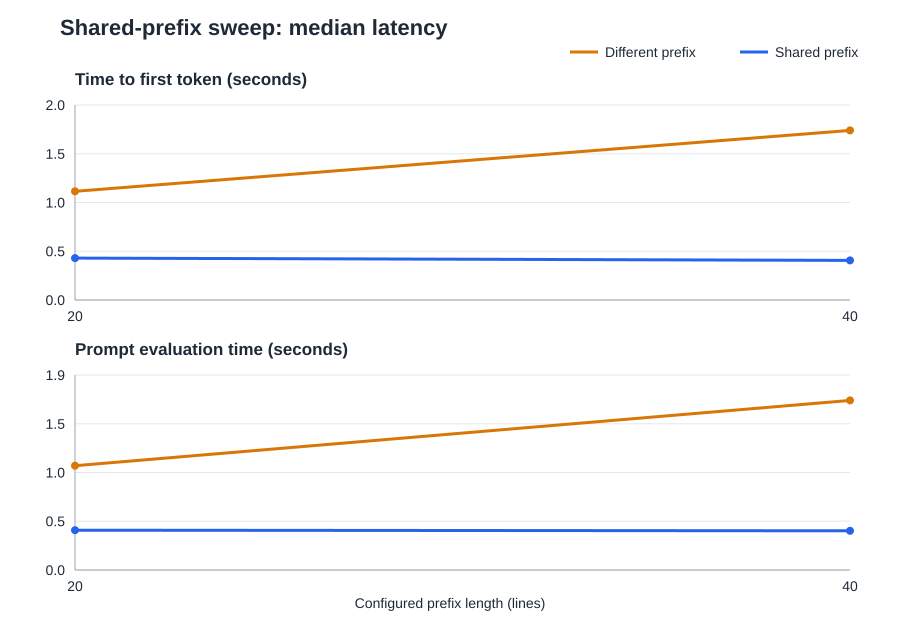
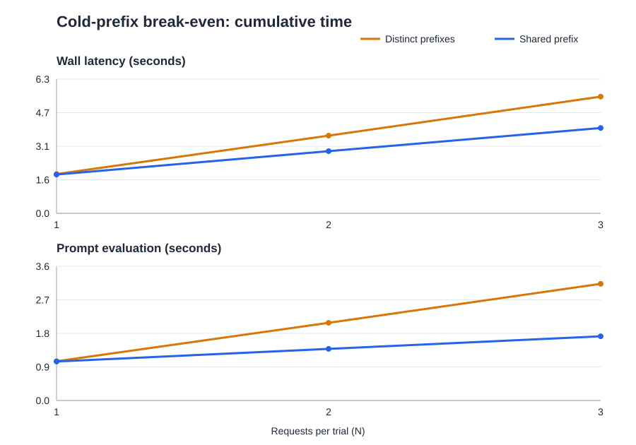

# Shared-Prefix LLM Inference Benchmark

A small local ML systems experiment on whether repeated long prompt prefixes change inference performance on Ollama. It runs on Windows with the installed `qwen2.5:7b`, records every request, and supports a primed single-length comparison, a prefix-length sweep, and a cold-prefix break-even analysis.

## Problem and hypothesis

Long contexts can make **prefill** expensive before the first answer token appears. If a serving engine retains attention state for a token-identical prefix between independent requests, a shared-prefix request should evaluate fewer new prompt tokens and reduce prompt evaluation time and often time to first token (TTFT). A faster second request alone does not prove prefix caching; model loading, kernel warm-up, scheduling, GPU clocks, and OS caching can also change timing.

## Run on Windows

Open PowerShell in this folder. Start the Ollama app (or run `ollama serve` in another terminal), confirm `ollama list` includes `qwen2.5:7b`, and run:

```powershell
python --version
ollama --version
ollama ps
python benchmark.py
```

No `pip install` is required; Python's standard library is sufficient. The default run uses three trials with five requests per scenario in each trial (30 measured requests), plus model warm-up and shared-prefix priming. It may take several minutes on a 6 GB laptop GPU because the 7B model may split across CPU and GPU. A shorter smoke run is `python benchmark.py --trials 1 --requests 2`; write its output to other paths if you want to keep the full run's results. CLI options include `--model`, `--url`, `--prefix-lines`, `--num-ctx`, `--max-output-tokens`, `--csv`, and `--summary`.

| Mode | Command | What it measures |
| --- | --- | --- |
| Primed single length | `python benchmark.py` | Repeated use of one explicitly primed prefix at 105 lines |
| Primed length sweep | `python benchmark.py --sweep` | Repeated use across six prefix lengths |
| Cold-prefix break-even | `python benchmark.py --break-even --max-requests 8` | First unprimed request plus subsequent reuse, compared with distinct prefixes |

## Prefix-length sweep

Run a short smoke sweep, then the full default sweep:

```powershell
python benchmark.py --sweep --prefix-lengths 20,40 --trials 1 --requests 1 --max-output-tokens 16
python benchmark.py --sweep
```

The full sweep tests 20, 40, 80, 105, 160, and 220 reference lines, with three trials and five measured requests per scenario at each length. Use `--prefix-lengths 20,80,160` to choose other lengths; it also enables sweep mode. The sweep writes [request rows](results/sweep_raw_results.csv), [per-length statistics](results/sweep_summary.json), and an [SVG chart](results/sweep_chart.svg). These are separate from the existing single-length `results/raw_results.csv` and `results/summary.json`. Override paths with `--csv`, `--summary`, and `--chart`.

Each CSV row contains the configured line count and Ollama's actual prompt token count. A distinct longest-length warm-up checks the context budget, and the runner checks every priming and measured prompt count plus `--max-output-tokens` and a 256-token reserve against `--num-ctx`. The JSON groups mean and median cached tokens, uncached tokens, prompt evaluation, TTFT, generation, wall latency, and per-request throughput by length and scenario. It also gives total measured request throughput (requests divided by summed wall time) and percentage improvements. Positive timing improvements mean the shared case was faster; positive throughput improvements mean it served more requests per second. The chart plots median TTFT and prompt evaluation against line count. Compare the actual token counts before attributing a timing gap to prefix reuse. **The reported workload uses a warm prefix:** priming requests are excluded from measured results and throughput.



## Cold-prefix break-even

Run the short smoke test shown below, or use a longer run with more trials:

```powershell
python benchmark.py --break-even --trials 2 --max-requests 3 --prefix-lines 40 --max-output-tokens 16
python benchmark.py --break-even --trials 5 --max-requests 8
```

Here **cold** means a new prefix on an already loaded, warmed model. Before each trial, the runner sends two short warm-ups and one unrelated long warm-up. It creates a fresh shared prefix for that trial, measures its first request **without priming**, then measures up to `--max-requests` distinct questions on the same prefix. The comparison sequence has the same request count and question indices, but a new, similarly sized prefix on every request. Scenario order alternates across trials. All requests use the existing sequential streamed settings (`qwen2.5:7b`, `raw=true`, temperature 0), and the warm-ups are excluded from results.

For each request count N, the runner sums the first N wall latencies and prompt evaluation times within each trial. It reports each trial's curve plus the mean cumulative curves across trials. Savings are distinct time minus shared time; percentage savings divide that difference by distinct time, and amortized time divides cumulative time by N. Wall and prompt-evaluation break-even points are reported separately as the first N with **strictly lower** mean shared cumulative time. A null break-even means the measured range did not cross. The first-request extra cost is also recorded; it can be negative because of timing variation.

The run writes [request-level CSV](results/breakeven_raw_results.csv), [cumulative CSV](results/breakeven_cumulative.csv), [JSON summary](results/breakeven_summary.json), and a [cumulative-time chart](results/breakeven_chart.svg). These paths are separate from the single-length and sweep results. Override them with `--csv`, `--cumulative-csv`, `--summary`, and `--chart`. Request rows include wall latency, TTFT, prompt evaluation, actual prompt and cached-token counts, generation time, output tokens, and whether the prefix was cold, warm, or new.

**Observed smoke run:** On Ollama 0.35.0, the two-trial, 40-line command above produced 12 measured requests. Mean cumulative wall times were:

| Requests (N) | Distinct prefixes | Shared prefix | Savings |
| ---: | ---: | ---: | ---: |
| 1 | 1.836 s | 1.814 s | 0.023 s (1.2%) |
| 2 | 3.633 s | 2.905 s | 0.728 s (20.0%) |
| 3 | 5.456 s | 3.990 s | 1.466 s (26.9%) |

The strict mean-curve break-even was N=1 for both wall latency and prompt evaluation. The first shared request averaged only 23 ms faster than the first distinct request, so that N=1 crossing is sensitive to noise; it does not demonstrate an amortized cold-prefix penalty. Later shared requests reported about 1,096 cached tokens, versus 2 on the first shared request. Measured model load durations were 6.5–8.3 ms, consistent with the model staying loaded. The run used only two trials, three requests, and 16 output tokens, so repeat with more trials and requests before treating a crossing point as stable. Prompt lengths and output lengths can vary slightly, and generation, thermal behavior, cache eviction, and block order can affect wall time.



## Primed single-length experiment

| Control | Value |
| --- | --- |
| Model / server | Local `qwen2.5:7b` / Ollama |
| Generation | Temperature 0, at most 80 output tokens |
| Context | 8,192 tokens; deterministic synthetic reference sets |
| Workload | 5 requests per scenario per trial, 3 trials |
| Concurrency | 1, sequential |
| Warm-up | 2 unmeasured short requests and 1 long request; shared prefix primed before each shared block |
| Order | Different/shared in odd trials; shared/different in even trials |

**Different prefixes:** Every request receives a different long reference set and a short question. **Shared prefix:** Every request receives the same long reference set and a distinct short question. Each run has a random identifier embedded in its reference sets so an earlier run cannot prime this run's baseline. All reference sets use the same template and line count, so actual prompt token counts can be checked in the CSV rather than assumed equal. `raw=true` avoids model chat template changes between requests. The common prefix is primed outside the measured shared requests; this experiment measures a warm-prefix workload, including the cost of priming only in the unmeasured setup.

## Architecture

```text
Client Requests
      |
      v
Shared System / Context Prefix + Question
      |
      v
Tokenizer
      |
      v
Prefill
      |
      v
KV Cache / Prefix Cache
      |
      v
Decode
      |
      v
Response
```

See [architecture.md](docs/architecture.md) for measurement details.

## Metrics

- **TTFT:** Client wall time from request start to the first nonempty streamed response chunk. Includes network and scheduling overhead.
- **Prompt evaluation:** Ollama `prompt_eval_duration`, the time spent evaluating uncached prompt tokens on current API versions. `prompt_eval_count` is full prompt length; `prompt_eval_cached_count` reports tokens read from cache when exposed.
- **Generation:** Ollama `eval_duration` and `eval_count`; decode tokens per second is their ratio.
- **Total:** Client wall latency and Ollama `total_duration` are both recorded. The two need not match because their timing boundaries differ.
- **Throughput:** Requests per second over the sum of measured request wall times, for each scenario. Prompt tokens per second divides uncached prompt tokens by prompt evaluation time; it is unavailable when the API omits the cached-token count.
- **GPU memory:** Whole-device `nvidia-smi` used-memory snapshot after each request, if available. It is neither model-only usage nor peak allocation.

`results/raw_results.csv` holds request-level data. `results/summary.json` holds mean and median for each metric. P95 is emitted only with at least 20 observations in a scenario; five or fifteen points cannot support a useful tail estimate. Positive improvement percentages favor shared prefix.

## Primed single-length results

Measured locally on 21 September 2026 with Ollama 0.34.2, `qwen2.5:7b`, Windows, an RTX 4050 Laptop GPU (6 GB VRAM), and 16 GB system RAM. Ollama reported the model split as 24% CPU / 76% GPU at an 8,192-token context. Each scenario has 15 measured requests across three trials; input prompts ranged from 2,815 to 2,846 tokens. The shared block was primed before measurement, so these results describe repeated use of an already warm prefix. The values below come from the linked CSV and JSON files.

| Metric | Different prefixes | Shared prefix | Change favoring shared |
| --- | ---: | ---: | ---: |
| Median prompt tokens | 2,835 | 2,816 | — |
| Median cached prompt tokens | 21 | 2,786 | — |
| Median uncached prompt tokens | 2,814 | 30 | — |
| Median prompt evaluation | 3.913 s | 0.730 s | 81.3% less |
| Median TTFT | 4.102 s | 0.761 s | 81.4% less |
| Median wall latency | 9.224 s | 4.880 s | 47.1% less |
| Mean wall latency | 8.697 s | 4.828 s | — |
| Mean generation duration | 5.072 s | 4.194 s | — |
| Mean output tokens | 80 | 66 | — |
| Request throughput | 0.115 req/s | 0.207 req/s | 80.1% more |
| Median whole-device GPU memory snapshot | 4,625 MiB | 4,608 MiB | — |

The measured cached-token gap is direct API evidence that this Ollama run reused most of the shared prefix across independent requests. The smaller percentage change in total wall latency reflects time spent generating output as well as evaluating the prompt. The shared requests generated fewer tokens on average (66 versus 80), so their generation-time difference cannot be attributed solely to prefix reuse. Uncached prompt tokens per second was lower in the shared case (median 41 versus 720) because the fixed overhead of evaluating about 30 remaining tokens dominates that small denominator; it is not a sign that shared prefill did more work. The run had 15 observations per scenario, so P95 is intentionally absent. See [raw measurements](results/raw_results.csv) and [summary statistics](results/summary.json) for request-level values, means, and medians.

## Interpretation and limitations

Input processing is called *prefill* because the model fills attention KV state for the prompt before autoregressive decode begins. A long prompt can delay TTFT even if the answer is short: the full input must be processed before the first output token. The KV cache stores per-layer key and value tensors for processed tokens. Identical prefixes can theoretically reuse that state, skipping repeated attention computation for those tokens. This tends to affect prefill and TTFT more directly than per-token decode speed, since every new output token still needs a forward step.

This matters when RAG requests repeat a large retrieved context, agents repeat tool instructions or history, long system prompts repeat policy text, few-shot prompts repeat examples, and multi-user production serving has a common system prompt. Reuse requires the same model and tokenized prefix, a compatible context and runner, enough cache capacity, and requests that reach the retained state before eviction. Prompt text that looks similar may tokenize differently; divergent system templates or metadata can break a match. On this machine, the 7B model partly ran on CPU, so GPU memory and latency reflect that hardware split. Small samples, thermal drift, background activity, and the excluded priming cost also limit generalization.

**Conclusion:** This Ollama 0.34.2 run showed a large cached-token count and shorter prompt evaluation for identical prefixes, consistent with cross-request KV/prefix reuse. The result establishes the behavior of this local model, runner, hardware, and warm-prefix workload; it does not establish universal performance across Ollama versions or a specific internal caching algorithm. A zero or missing cached-token count in another run should trigger an investigation of engine behavior, cache settings, prefix identity, retention, and measurement noise. Repeating the same workload under an engine with an explicit prefix-cache hit metric, such as vLLM, would provide a useful independent comparison.

## Interview explanation of the primed run

“I built a controlled local inference benchmark that compares equal-sized long prompts with unique versus identical prefixes. It streams from Ollama so I can measure client TTFT, and it records server prompt/decode timings and cached-token counts. I warm the model, prime the shared context deliberately, alternate scenario order, and save per-request data so any claimed speedup is tied to evidence of prompt reuse rather than a faster warm model.”

## Five-sentence result explanation

I benchmarked 30 sequential requests to a local `qwen2.5:7b` model on Ollama 0.34.2, comparing distinct roughly 2,800-token prefixes with a repeated prefix of similar length. The shared case cut median prompt evaluation from 3.913 seconds to 0.730 seconds and median TTFT from 4.102 seconds to 0.761 seconds, while median wall latency fell from 9.224 seconds to 4.880 seconds. Ollama reported a median of 2,786 cached prompt tokens for shared requests versus 21 for distinct requests, so the prefill reduction is consistent with cross-request prefix reuse in this run. This demonstrates how retaining KV state for identical prompt tokens can remove repeated prefill work, while output length and generation time also affect total latency. In production RAG, agent, and multi-user systems, the same mechanism can improve response latency and throughput when requests reuse a stable context.
